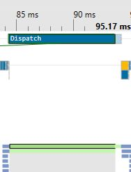
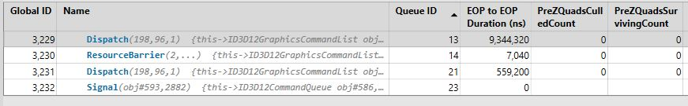
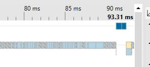
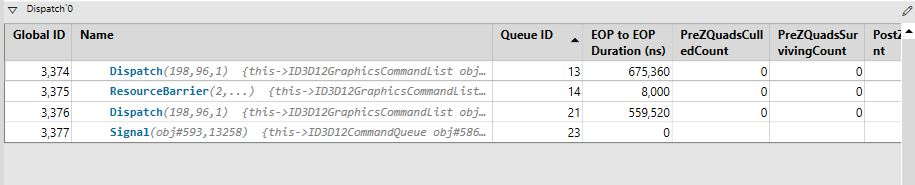
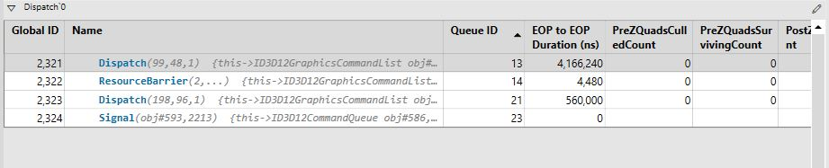

# SSAO 최적화

## 문제점

  
  
10ms로 전체 시간의 10%를 잡아먹고 있다.  
그중에 가장 큰 영향을 끼치는 것으로는 샘플링  
개수와 해상도 반지름이 있다. 그리하여
반지름, 가중치, 샘플링 개수를 매개변수로 처리하였다.

아래는 적용할 방식이다.  


## SSAO인자 최소화


  
샘플링 개수를 64개에서 5개정도로 줄여주었더니  
확실히 차이가 난다. 보통 포럼에서 언급되는 정도로  
1ms 수준이 되었다.

## 해상도를 절반으로



```C++
//8개 단위로 나누는데 텍스쳐 크기가 화면의 1/2배라서 16
m_pSSAOCommandList->Dispatch(ceil(m_clientWidth / (float)16), ceil(m_clientHeight / (float)16), 1);
//SSAOCS
g_Dst.GetDimensions(size.x, size.y);
float2 uv = (DTid.xy + 0.5) / (size - 1);
//SSAOBlurCS
g_Dst.GetDimensions(size.x, size.y);
float2 uv = (DTid.xy + 0.5)/size;
```

dst텍스쳐의 해상도를 와 threadID를 0.5로 offset을  
둔 뒤에 uv값만 가져오는 방식으로 다운/업샘플링 해주었다.  
풀스크린의 위치/법선값을 0.5로 offset을 둔 뒤에  
해상도가 절반이 줄은 만큼 생성에도 시간이 절반이 줄었다.  
이렇게 보니 Blur자체는 병목이 아닌 것으로 보인다.

#### 참조

[유니티 - AO 최적화](https://docs.unity3d.com/Packages/com.unity.render-pipelines.universal@14.0/manual/post-processing-ssao.html)  
[소마 -ssao사례](https://www.gamedeveloper.com/programming/generating-smooth-and-cheap-ssao-using-temporal-blur)
