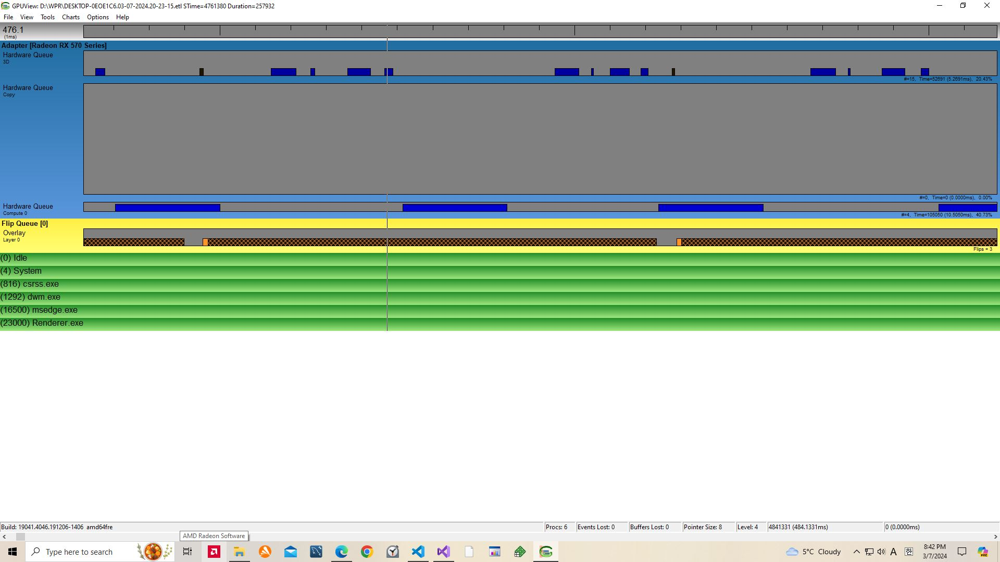
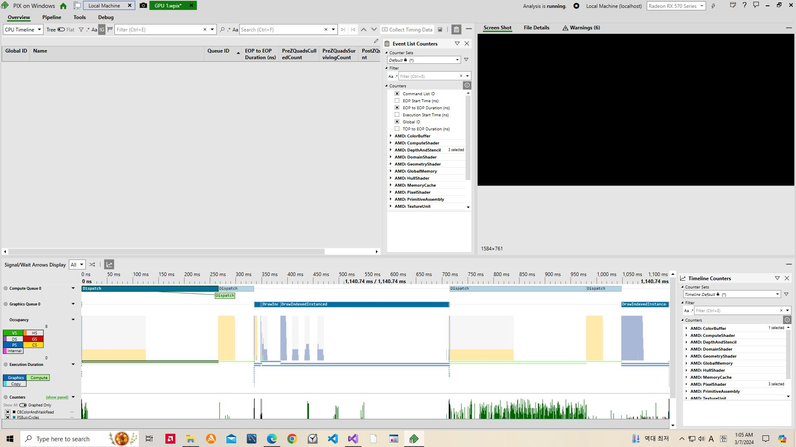
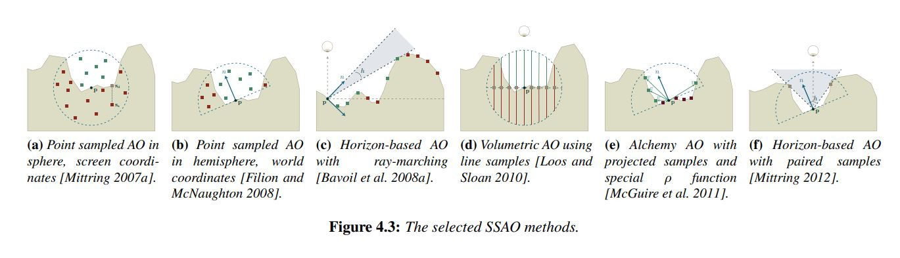
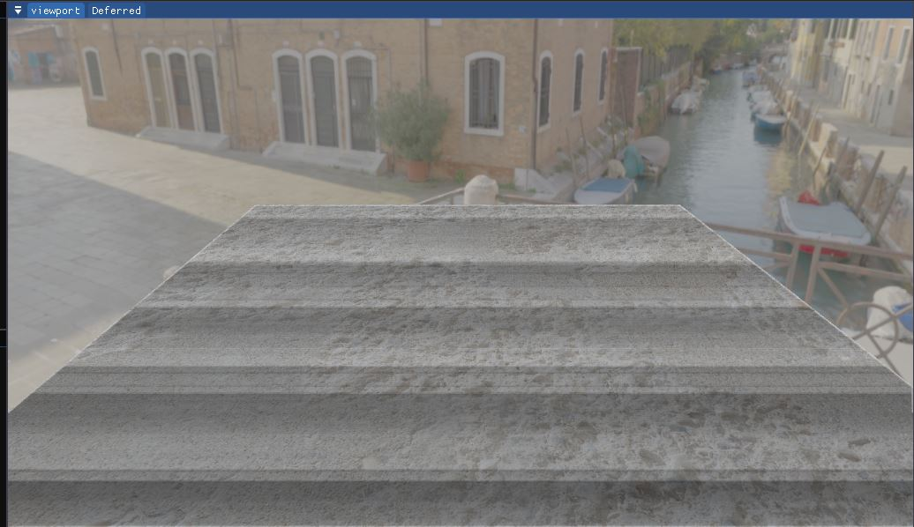
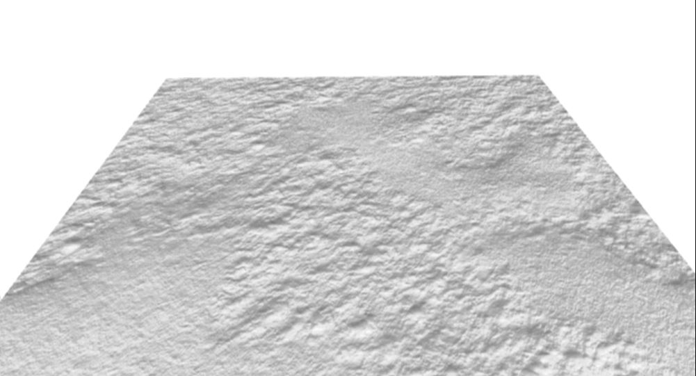

# SSAO 컴퓨트 큐, 큐 병렬 실행

내 그래픽 카드보다 얼마 이전에 나온 기종도 이렇게 ~~병렬(parallel)로~~ 작동하는데 분명이 이유가 있을것이다.
  

AyncCompute에 대한 오해가 있었나보다. 흔히 cpu에서 생각하던 정말로 동시로 실행하는 Parallel이 아닌 concurrent다.
어쩄든 적용하는 게 빠르다.  
어쩃든 초점은 gpu를 항상 바쁘게 하는 것이다. 명령어 큐 간의 wait와 signal을 통해서.

## 상수 선언

그냥 상수임에도 hlsl에는 상수버퍼로 표기된다. ~~8\*8단위로 화면의 크기만큼 dispatch를 해주기 위해 필요하다.~~  
허나 다시 vPos, vNormal을 Gbuf에 추가하였다.

## 다시 vNormal vPos를 쓰던 방식으로

SSAO도 방식만 해도 10개가 넘는다.

각 방식은 텍스쳐 사용자 선호에 맞게 AO값을 조절 할 수 있는 변수 집합을 가지고 있다.
AO'(AO) = (b \* (AO + a))^c;
b와 c는밝기와 대비를 조절하고 a는 self-occlusion을 방지하기 위함이다.

여전히 밴딩문제는 해결 못했다.

> When a fixed pattern is used, banding
> occurs. When a random pattern is used, high frequency noise is
> added

난수를 도입해야하는데 문제는 난수벡터를 어떻게 적용하는 가이다.

결국 문제를 해결 못하였다. 다시 deferredGeoPass 뒤로 넘기고 tbn을 다시 생성하는 대신에
w_normal만 g-buf로부터 가져와서 뷰행렬에 곱해서 쓰기로하려고도 헀으나, viewNormal계산할때
비균일 scale로 인한 법선 계산 오류를 방지하기 위해 처음부터 (v\*w)^-1)^T를 해야한다.
행렬 성질을 이용하면 ((V^-1)^T)만 뒤에 따로 곱해주면 된다. 그래서 뷰 역행렬만 또 매핑 해주었다.

일단 normalMapping후의 normal을 가져와도 잘 되긴 한다. 카메라 움직이는 동안의 검은 빛이 되는 에러가 있긴하다.
정말 궁금한점은 normalMapping을 적용 전/후 중에 어떤 맵을 가져오냐는 것이다.
바꾸는 거야 금방한다. 잘 생각해보니 실제 geometry의 표면을 따라 샘플링하는 게 올바르지 싶다.
결국은 원래 방식대로 돌아왔다. 바뀐건 CS를 쓰는 것일뿐..

### 기타 변경 사항

- MatrixBuffer 구조체를 월드, 뷰, wvp, 월드 역, wv 역행렬로 재구성
- 깊이로부터 월드 위치 벡터를 추출하지 않기 때문에 FrustumInfo관련 함수/변수 제거
- \_Gbuf_CNT로 따로 gbuffer개수를 선언 했던걸 enum의 마지막 변수로 대체

#### 참조

[비동기 큐를 적용한 AMD의 DX12예제](https://github.com/GPUOpen-LibrariesAndSDKs/nBodyD3D12/tree/master/Samples/D3D12nBodyGravity)  
[비동기 큐 관련](https://www.khronos.org/assets/uploads/developers/library/2016-vulkan-devday-uk/9-Asynchonous-compute.pdf)  
[SSAO 기법이 정리된 어느 학생의 학사 논문](https://www.gamedevs.org/uploads/comparative-study-of-ssao-methods.pdf)
