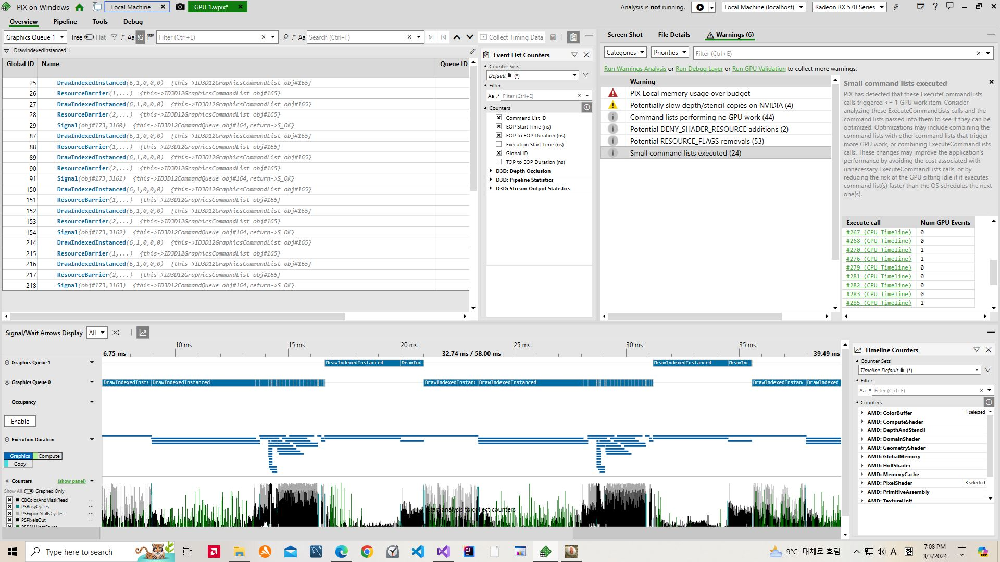

# Shader Variant, SSAO from Z, Pre-Zpass, 그리고 명령어 큐

## Shader Variant

GPU는 병렬 작업에 특화된 하드웨어다. gpu는 다수의 쓰레드를 병렬로 실행가능 하며
워프(warp)라고 부르는 하나의 쓰레드 그룹단위로 실행하는 게 보통이다.
각 워프는 한번에 한 명령문 만을 실행가능한데 분기문을 만나면 워프내의 쓰레드들이
다른 루트를 타게 된다. 이들은 동시에 실행될 수는 없고 한쪽의 실행이 끝나야지
다른 쪽이 실행된다. 결국은 순차적으로 돌게 되며 결과는 한쪽만 받아진다.


hlsl에서 제공하는 컴파일 키워드로는  
[flatten] : 미리 두 경우 다 연산 해놓고 결과에 따라 선택
[branch] : 우리가 흔히 알던 if문처럼 한쪽만 연산하는 것

PBRGeoPass에 쓰이는 쉐이더들의 경우의 수만큼 쉐이더를 작성하였다. 인클루드될 쉐이더에
if문대신에 #ifdef를 대신 써주고

```
PixelOutputType main(PixelInputType input)
{
PixelOutputType output;
float3 normal = normalize(input.normal);
float2 texCoord = input.tex;
#ifdef HAS_NORMAL
...
}
```

#define으로 적용될 블락을 활성화 해준다. C의 그것과 원리가 같다.

```
///Nomral, Height맵이 적용되는 경우
#define HAS_NORMAL 0
#define HAS_HEIGHT 0
#include "PBRGeometryPS.hlsli"
```

D3DCompileFromFile 함수로 쉐이더 컴파일시에 그냥 hlsli넣는 걸로 안되고 include handler인자도 설정해줘야한다. D3D_COMPILE_STANDARD_FILE_INCLUDE 인자를 전달화면 기본값이 전달되는 데
현재 폴더와 관련된 파일들을 포함시킨다고 한다.

## Pre-Zpass

Frame맨처음에 거치는 Pass로써 깊이 값만 기록하는 과정이다. 당연히 PS는 필요없다.
이후 깊이 테스트 통과를 하는 개체만 PS를 실행시키도록한다. 물론 전체 Scene을 두번 그리기는
아까우니 향후에 가속알고리즘을 도입해야한다.


depth테스트는 ps후에 하는 줄알았는데 그전에도 가능하다. 하드웨어가 조건만 맞으면 해주지만 hlsl 메인 함수에 [earlydepthstencil]써주면 명시적으로 실행시킬수가있다. 단, 더 이상의 쓰기가 이루어지지 않는다는 보장이 있어야 작동한다고한다.

DethpEnable인 상태로 dsv로 nullptr전달하려면 Format을 Unknown해줘야함.

테스트가 작동은 하지만 여전히 매우 느리다. 되려 5~6frame정도 하락했다. 전체 씬을 한번 더 그린다는 걸 감안하면 그나마 덜 느리긴하다.

## 깊이 버퍼를 통한 SSAO

깊이버퍼로부터 vPos계산이 가능하다고 한다. 추가 계산이 필요하지만 1개 채널만 있으면 되서 메모리는 되려 감소한다.
기존 SSAO알고리즘에서는 각 윈도우 픽셀마다 뷰공간에서 랜덤 지점들을 생성, nearZ에 투사하여 해당 픽셀의 Z버퍼 값과 비교한다.
이 뷰공간의 지점들은 geoPass에서 생성되는 데 오로지 깊이버퍼로만 이것들을 생성이 가능하다고 한다.

(잠깐 복습)
오브젝트 공간의 정점은 wvp행렬에 곱해져서 nearZ평면에 투사된다. 결과는 w값을 뷰공간Z로 갖는 4차원 벡터이다. 이 벡터를 보고 우리는 클립공간에 있다고 한다. 클립공간은 시스템 값으로 취급되며 gpu가 xyz값을 -w와w값사이로 클립한다. 그 후 gpu는 동차나누기를 실시하는 데 이 결과를 보고 ndc공간에 있다고 한다. 정점은 보통 삼각형을 구성하는 지라 gpu는 3개의 ndc벡터들을 보간하여 pixel을 처리한다.

z버퍼 처리 관해서는 죄다 수학이다. z값을 픽셀로 부터 샘플하여 뷰공간 벡터를 만들고자한다 치자. 우리가 할것은 이전에 언급한 내용을 역으로 취하면 된다. 근데 죄다 opengl기준이라서 오랜만에 dx11책을 봐야만 했다. dx계열은 스크린공간에서도 z값이 ndc의것 그대로다(x,y는 -1~1). pro[2][3], pro[3][3]원소로부터 뷰공간 z값을 뺴오면 된다.

vPos, vNormal를 PbrGeo패스에서 뺴고 ssao패스에서 직접 계산하는 대신에 SSAO/blur패스 만을 위한 commandQueue와 전용 쓰레드를 만들어서 lightingPass직전까지 병렬로 계산하도록 바꾸었다.  
구현은 성공했으나 여전히 느리다.

## 명령어 큐


이 사진보고 무작정만들긴 했는데 PIX에서 보니 둘다 Concurrent하게 돈다.


한가지 간과한 사실이 있었다. MSDN에 따르면 GPU에는 세가지 타입의 독립 적인 엔진들이 있다고한다.
Copy: 복사만 가능
Compute: 계산 쉐이더, Copy기능 포함
3D: 모든 기능, Compute기능 포함.

그리고 이 서로 다른 엔진들이 parallel하게 실행가능하다고 한다. 이것도모르고 3D 커맨드 큐만
여러개 만들었으니 스위칭만할 수 밖에없었다.

https://youtu.be/H1L4iLIU9xU?si=24xQZz2l3Vzyp1iw&t=1270
영상에 따르면 밉맵말고도 SSAO, 라이팅, 후처리등의 작업도 계산 쉐이더를 이용한다.
최대한의 병렬성을 이용하는 것이다.

당장 기존 그래픽스 쉐이더에서 계산쉐이더로 옮기는 게 시급해졌다.

---

### 기타 변경 사항

-PerModel 구조체를 shader에 상수버퍼로써 넘기지 않고 shader를 선택하는 데 쓰도록 변경  
-PbrGeoPass 쉐이더를 텍스쳐 조합 경우의 수만큼 생성 해줌. 이에따른 Pso도 추가
-frustum내에 그려진 모델 수를 저장하는 변수에 여러 쓰레드들이 한꺼번에 접근해서 에러발생.  
 frustum내에 모델 수를 저장하는 명령문을 잠시 없애고, skybox는 후처리단계 직전으로 미루기로함  
 기존에는 G버퍼의 diffuse맵에 그린뒤에 라이팅시에 분기문을 통하는 등의 번잡한 과정을 거쳤음

-vPos를 Depth에서 뺴오도록 변경.  
-전체 모델들 하나의 배열로 다시 구성하는 함수를, 모델갱신시에만 다시 처리하도록 변경  
-DrawENTT함수에서 분기문이 많아져서 결국에 bool변수 말고 ENUM으로 어떤 pass인지 결정하기로함.

#### 참조

[유니티 - 쉐이더 분기](https://docs.unity3d.com/kr/2021.3/Manual/shader-branching.html)  
[MSDN - earlyDepthStencil](https://learn.microsoft.com/en-us/windows/win32/direct3dhlsl/sm5-attributes-earlydepthstencil)  
[엔비디아 - 쉐이더 분기](https://developer.nvidia.com/gpugems/gpugems2/part-iv-general-purpose-computation-gpus-primer/chapter-34-gpu-flow-control-idioms)  
[깊이버퍼를 통한 ssao구현](https://ogldev.org/www/tutorial46/tutorial46.html)  
[쉐이더 분기에 관한글1](https://www.peterstefek.me/shader-branch.html)  
[GPU용어사전1](https://byounghee.me/2023/05/04/gpu-%EC%9A%A9%EC%96%B4%EC%82%AC%EC%A0%84-part3-thread-warp/)  
[GPU용어사전2](https://cuda.readthedocs.io/ko/latest/CUDA_int/)  
[GPU 엔진](https://learn.microsoft.com/en-us/windows/win32/direct3d12/user-mode-heap-synchronization)  
[AMD 비동기 큐](https://gpuopen.com/learn/concurrent-execution-asynchronous-queues/)
