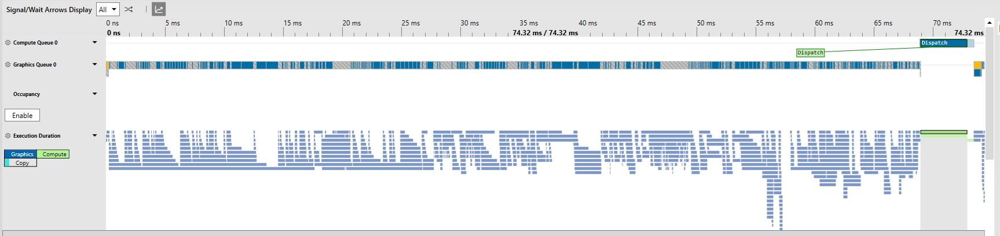
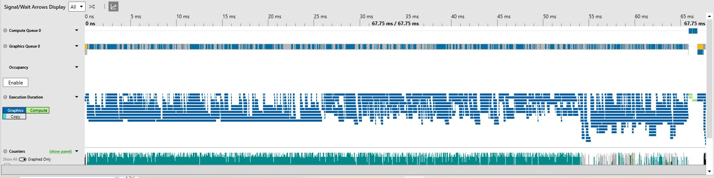
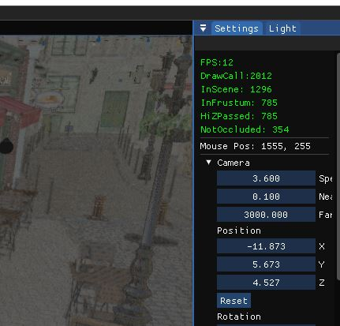
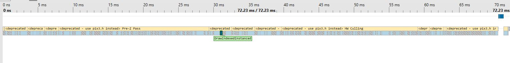
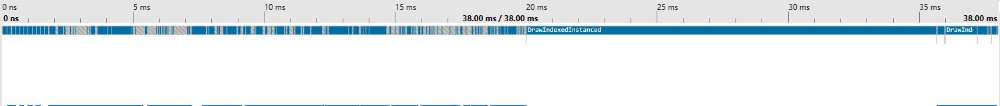

# 개체 정렬



## 가까운것 부터 그리기

카메라에 가까운 순서로 개체들을 차례대로 그리면  
earlyDepthTesting으로 최적화의 여지가 있다.  
ndc공간으로 변경한뒤에 정렬하였다.

```C++
bool Model12::SortModelByDepth(const Model12* pModel1, const Model12* pModel2)
{
    MatBuffer12* pMatBuffer1 = pModel1->GetMatBuffer();
    XMMATRIX mat1 = pMatBuffer1->GetWVPMatrix();
    mat1 = XMMatrixTranspose(mat1);
    Sphere* pSphere1 = pModel1->GetSphere();
    XMFLOAT3 center = pSphere1->GetCenter();
    XMVECTOR center1 = XMLoadFloat3(&center);
    center1 = XMVector4Transform(center1, mat1);
    XMFLOAT4 ndc1;
    XMStoreFloat4(&ndc1, center1);
    ndc1.z /= ndc1.w;

    MatBuffer12* pMatBuffer2 = pModel2->GetMatBuffer();
    XMMATRIX mat2 = pMatBuffer2->GetWVPMatrix();
    mat2 = XMMatrixTranspose(mat2);
    Sphere* pSphere2 = pModel2->GetSphere();
    center = pSphere2->GetCenter();
    XMVECTOR center2 = XMLoadFloat3(&center);
    center2 = XMVector4Transform(center2, mat2);
    XMFLOAT4 ndc2;
    XMStoreFloat4(&ndc2, center2);
    ndc2.z /= ndc2.w;

    return ndc1.z< ndc2.z;

}
//프러스텀 컬링 직전에 정렬
std::sort(m_pTotalModels.begin(), m_pTotalModels.end(), Model12::SortModelByDepth);
```

개체 배열인 total오브젝트를 카메라가 이동할떄  
마다 정렬하여 갱신 하도록 하였다.  
  
기껏해야 1프레임 정도 늘어 난 것같다.  
이게 병목이 아닌 모양이다.

## 상태변경 최소화

실제로 행해지는 것이 없어도 API호출을 통한 상태변화에는  
GPU에 많은 작업들이 수반된다. 뷰포트, 힙설정등 중복되는  
상태 설정은 지웠다.


허나 별 소용이 없었다. 현재 드로우콜이 2천개가 육박하기 때문이다.  
그림자까지 그려버리면 3천개는 쉽사리 넘길 것이다.  
subMesh단위로 보면 6482개에 육박한다. 괜히 느린게 아니였다.

## subMesh 클래스

텍스쳐 atlas를 만들어볼까했지만 이 fbx파일은 워낙에 커서 다 만드는데  
며칠을 걸릴 것이다.

pso가 같은 것끼리 정렬하여 그 집합안에서 가까운 것끼리 정렬 하기로 헀으나  
하위 메시의 존재로 정렬도 불가피하다. 이 하위메시들을 정의하는 클래스를  
만들어서 이 것들의 배열로 정렬 후 Draw하기로함. 이 하위 메시 클래스는  
사용자에게는 드러나지 않도록, 즉 UI로는 접근 못하도록함.  
머티리얼이 같은 것끼리 sort. 머티리얼이 같다->pso도 같다  
구조는 간단하게 vbv, ibv, 행렬만 가져오기로했다.

```C++
//group에서 처음 보는 머티리얼 발견시
if (groupMatSet.find(pSurfaceMaterial) == groupMatSet.end())
{
    MaterialInfo matInfo;
    groupMatSet.insert(pSurfaceMaterial);
    localMatSet.insert(pSurfaceMaterial);
    matInfo.material = LoadFbxMaterial(pSurfaceMaterial);
    LoadFbxTex(filePath, pSurfaceMaterial, &matInfo, matNames, pDevice);
    submeshStride.push_back(i);

}
//현 mesh에서 처음 보는 머티리얼 발견시
else if (localMatSet.find(pSurfaceMaterial) == localMatSet.end())
{
    localMatSet.insert(pSurfaceMaterial);
    FbxString matNameFStr = pSurfaceMaterial->GetNameOnly();
    std::string matName(matNameFStr.Buffer());
    matNames.push_back(matName);
    submeshStride.push_back(i);
}
//
if (submeshStride.size() > 1 && submeshStride[submeshCount + 1] == j)
{
    ++submeshCount;
    vertexDataPos.push_back(m_vertexCount);
    indicesPos.push_back(m_indexCount);
}

```

```C++
//Model12::BindMaterial()
for (int i = 0; i < m_matNames.size(); ++i)
{
    PerModel perModel = { false, };
    int idx = mathash[m_matNames[i]];
    MaterialInfo matInfo = matInfos[idx];
    m_matInfos.push_back(matInfo);
    //subMesh에 보낼 srv배열 생성
    texSrvs.push_back(textures[idx]);

    idx = texhash[matInfo.diffuseMap];
    m_texHash[matInfo.diffuseMap] = m_texSrvs.size();
    m_texSrvs.push_back(textures[idx]);

    if (!matInfo.normalMap.empty())
    {
        idx = texhash[matInfo.normalMap];
        m_texHash[matInfo.normalMap] = m_texSrvs.size();
        m_texSrvs.push_back(textures[idx]);
        perModel.hasNormal = true;
    }
    else
    {
        texSrvs.push_back(m_nullSrvs[nullCount++]);
    }
    //...
    m_pSubMeshs[i] = SubMesh(m_vbV, m_subIbVs[i], m_pMatBuffer, perModel, texSrvs);
}
```

ModelGroup클래스의 텍스쳐 배열로부터 머티리얼에 필요한  
srv를 뺴오는 함수이다. 없으면 널srv를 넣어준다.

Mesh 단위로 컬링을 한뒤에 subMesh큐를 채우도록 함.

```C++
if (result)
{
    std::vector<SubMesh*> subMeshes= m_pTotalMeshes[i]->GetSubMeshes();
    for (int j = 0; j < subMeshes.size(); ++j)
    {
        m_pSubMeshQueue.push(subMeshes[j]);
    }
}
```

머티리얼 단위로, 후에 인스턴싱을 할 수 있게 끔, 정렬하도록 했다. 머티리얼  
이름을 가져와서 사전순으로 정렬하도록 하였다. 프러스텀 컬링 직후에 정렬하니  
더 느려서 HW오클루전 컬링이후에 sort했는데도 속도는 그대로다. 여전히 gpu에  
가는 명령이 많으니 당연하다. subMesh단위라서 쓰레드당 풀링수를 100개로 늘려
보았으나 별효과가 없다. 오히려 GPU가 논다.

geo패스뺴고는 Mesh단위로 그려보았다. 여전히 차이가없다.
  
Pre-Zpass와 HW 오클루전 Pass에서 시간을 각각30ms씩이나 잡아먹는다.
이것들을 해결하지 못하면 다른 최적화를 해줘도 소용이 없다.
  
예전에 만든 D3D11 버전을 pix로 확인 해보니 PbrGeo패스에서 중간중간에  
노는 구간이 꽤나 보인다. ssao를 1ms로 줄이고보면 대략 20ms인데 pre-z패스와  
HW오클루전 패스가 있었다면 12랑 엄청 크게 차이는 안났을 것 같다.

## 인스턴싱

지금처럼 이름이 다르지만 같은 Mesh일경우? 같은 기둥이면 인스턴싱이 낫다.  
같은 Mesh인지 구분하려면 머티리얼 이름만으로는 부족하다. 행렬 배열을  
MatBuffer에 만들어 같은 Mesh이면 거기다가 배열만 추가하는 식으로  
하는 편이 나을 것이다. 물론 사용자에게는 이런 로직이 가려져야 할 것이다.  
다만 같은 Object 스폰시에 한꺼번에 instancing이 처리되야하니 m_pTotalMeshes  
갱신할때 한꺼번에 처리하도록 해야한다.

머티리얼 이름, 그리고 색인 개수를 비교해서 같다면 참이라고 판단하였다.

시점이 행렬 배열은 그대로라서 컬링 여부를 확인할 방법이 필요하다.  
동적으로 D3D12에 배열을 생성하여 상수버퍼로 10개 단위로 전달하였다.  
워커 쓰레드별로 행렬 배열 버퍼를 등록해준다.

월드행렬은 죄다 기본행렬인데 실제파일에서는 정점값이 달라서  
같은 메쉬라도 인스탄싱이 불가능하다. 시간만 날렸다...

### 기타 변경 사항

- Settings에 드로우콜 카운터 추가
- 메인 명령어 리스트에말고 워커 쓰레드에 PIX이벤트 설정
- 이름 혼동으로 인해서 ModelGroup->Object, Model->Mesh로 바꿈
- .obj용으로 놔둔 Material 상수 버퍼를 PbrGeoPs에서 제거
- 테스트 용으로 놔둔 인스턴싱 ToggleInstancing() 기능 제거.
- 카메라 이동시에만 컬링을 실시하도록 변경
- UploadBuffers에서 SetVBandIB와 SetTexture함수로 분리. 불필요한 텍스쳐 설정을 막기위함.

#### 참조

[스택 오버플로우- 가까운순서대로 그리는 이유](https://stackoverflow.com/questions/15673187/is-drawing-front-to-back-necessary-for-optimizing-renders)  
[2016/03/GDC_2016_D3D12_Right_On_Queue_final]
