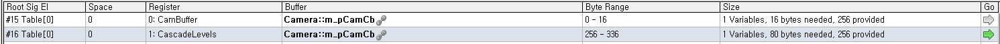

# 비디오 메모리 풀 관리

## D3D에서의 자원

D3D에서의 자원은 물리적 GPU 메모리 사용을 추상화 하는 개념이다.  
리소스는 물리적 공간에 접근하기 위해 GPU 가상메모리 공간 필요하다.
리소스 생성은 free-threaded하다. 가상메모리 공간 생성에 대하여  
세가지 리소스 타입이 존재한다.

Committed resources: 커밋된 자원은 여러 세대에 걸친 가장 기본적인
개념이다. 이러한 자원의 생성은 가상메모리 공간 뿐만아니라 해당자원을  
충분히 포함할 정도의 암묵적(implicit)힙을 생성하고 힙의 물리적메모리에  
대해 가상 메모리 범위를 커밋한다. app측에서 각 자원에 대해
MakeResident/Evict를 호출 해줘야한다. OS의 페이징 로직에 의존적이다.

Reserved resources: 예약된 자원은 D3D11의 타일 자원과 동등한 것이다.
생성시에 가상자원의 범위만이 할당 되며 어떤 힙에도 매핑되지 않는다.
app측에서 나중에 힙에다가 직접 매핑해줘야 한다.

Placed resources: D3D12에 처음 도입된 개념으로 리소스와는 별개로  
힙을 생성할 수 있다. 그후 다수의 자원을 하나의 힙내에 위치 시킬수 있다.
ReservedResourced의 생성없이도 가능하다. 각 힙에 대해 MakeResident  
/Evict를 호출 해줘야한다. app측에서 자원 할당을 관리해야한다.

## Over-Commitment

근데 64KB라는 자원 제약이 생겨서 변수 한 두개 쉐이더에 바인딩한다고  
상수 버퍼 만들면 committed memory를 남발하면 큰일 난다. 할당/해제가  
게임플레이에 지장을 줄 뿐더러 물리적 비디오 메모리가 부족해진다.  
만약 정말로 다 소진된다면? 결과는 드라이버에 달려있다. 할당이 실패하거나  
기존의 블록들을 시스템 메모리로 이주시킨뒤에 성공하거나. 또한 다른 app들도  
비디오 메모리를 쓸 수 있다는 사실도 잊지말자. 이러한 페이징 인/아웃은  
GPU성능을 매우 저하시킨다. 이를 수동으로 관리하려면 MakeResident  
/Evict를 호출 해줘야한다. 해당 발표자료에서는 크게 블록을 잡고  
PlacedResource를 쓸것을 권장한다.

## 대책

힙을 크게 잡고 PlacedResource를 할당/해제한다.  
주소관리는 HeapManager클래스에서 함수로써 관리해준다.



CreatePlacedResource를 해도 여전히 64KB제한은 못피한다.  
기존에 잘모르고 commited resource하나에다가 camPosCBV, cascadeCBV  
이렇게 메모리 주소와 크기만 바꿔서 2개의 뷰를 만들어썼었다. 여기서  
placedResource생성 자체도 HeapManager클래스에서 하게 되었다.  
실제 vram 가상주소는 heapManger만알고 외부 클래스는 크기와  
offset만 주고 핸들만 받는 식으로 변경하였다.  
(offset+데이터크기)%(블록크기)로 블록 인덱스를 구하여 접근.

```C++
void HeapManager::AllocateVertexData(UINT8* pVertexData, UINT64 vbSize)
{
    UINT64 blockSize = (_VB_BLOCK_SIZE )/ _HEAP_BLOCK_COUNT;
    UINT idx = m_curVbHeapOffset / blockSize;
    UINT newIdx = (m_curVbHeapOffset + vbSize) / blockSize;
    if (newIdx != idx)
    {
        m_curVbHeapOffset = CUSTUM_ALIGN(m_curVbHeapOffset, blockSize);
    }
    m_curVbHeapOffset += vbSize;

    memcpy(m_pCurVbBlockMappedPtr[newIdx], pVertexData, vbSize);
    m_pCurVbBlockMappedPtr[newIdx] += vbSize;
}
```

문제는 쿼리ReadBack버퍼나 방벽이 필요하거나 텍스쳐 업로드 버퍼처럼  
리소스에대한 comPointer가 필요한 경우이다. 결국은 cb용 HEAP 말고
텍스쳐 UPLOAD용, 쿼리용 힙을 따로 주기로함. 애초에 쿼리는 디폴트힙이라  
따로 만들어 줘야했다.

텍스쳐는 HDR크기가 4k라 문제. 이것만 committedResource를 허용할까도
했으나 그냥 쓰기로했다. 굳이 HDR 아니더라도 64KB는 금방 넘긴다.

```C++
//HeapManager::CreateTexture()
D3D12_RESOURCE_ALLOCATION_INFO info = pDevice->GetResourceAllocationInfo(0, 1, &texDesc);

HRESULT hr = pDevice->CreatePlacedResource(m_pTexHeap, m_curTexHeapOffset, &texDesc,
    state, pClearValue, IID_PPV_ARGS(ppTex));
assert(SUCCEEDED(hr));
m_curTexHeapOffset += CUSTUM_ALIGN(info.SizeInBytes,_64KB);
```

SSAO, 위치, 법선, PBR 텍스쳐들은 DXGI_FORMAT_R16G16B16A16_FLOAT
Hi-Z는 d32, 그 외는 DXGI_FORMAT_R8G8B8A8_UNORM으로 변경했다.

쿼리버퍼는 CopyBufferRegion()에 쓸 오프셋값만 D3D12클래스에 저장후 사용.

```C++

UINT resultSize = 8;
UINT64 offset = m_pHeapManager->GetQueryHeapOffset();
m_QueryResultOffset[i] = offset;
m_pHeapManager->SetQueryHeapOffset(offset + 8);

//D3D12::HWQueryForOcclusion()
ID3D12Resource* pQueryBlock= m_pHeapManager->GetQueryBlock();
m_pWorkerCommandList[threadIndex]->ResolveQueryData(m_pQueryHeap[threadIndex], D3D12_QUERY_TYPE_OCCLUSION, 0, queryCnt, pQueryBlock, m_QueryResultOffset[threadIndex]);
```

그리고 생각보다 정점데이터 크기가 매우 크다 MB단위까지 간다..  
게임 로직은 없는 단순 뷰어라서 동적 할당/해제가 없어서 당장은  
메모리 블락 해제 로직은 안 넣었다. 테스트하는 데에도 시간이  
많이 걸릴 것이다. 일단은 메모리낭비를 줄였다는 것에 만족

### 기타 변경 사항

- DescripotrHeapManager를 HeapManager로 이름변경, 용도 확장
- HeapManager클래스에 여러 힙을 멤버 변수로 선언.
- Resource생성 자체도 HeapManager에서하도록 변경
- D3D12::BoolCb, ColorCb삭제
- D3D12::pRoughnessCbBegin, m_pSSAOKernalCbBegin, m_pEquirect2CubeCbBegin추가
- m_pMipCb는 직전의 밉 레벨의 해상도를 구하므로 Resolution상수버퍼를 써도되서 삭제
- m_pUAVTex변수를 밉맵생성의 용도에 맞게 이름을 m_pGenMipUavTex로 변경
- hi-z컬링의 최대 테스트 개수를 지정 \_HI\*Z_CULL_COUNT로 선언
- 여러 \_ALIGN 마크로들을 \CUSTUM_ALIGN()으로 통합

#### 참조

[MSDN - Committed/Reserved/Place리소스 설명](https://learn.microsoft.com/en-us/windows/win32/direct3d12/uploading-resources)  
[GPU-Open - dx12/vulkan 소개](https://gpuopen.com/wp-content/uploads/2017/02/Hodes_Stephan_DirectX12_And_Vulkan.pdf)  
[Practical_DX12_Programming_Model_and_Hardware_Capabilities](https://gpuopen.com/wp-content/uploads/2016/03/Practical_DX12_Programming_Model_and_Hardware_Capabilities.pdf)  
[gdc_2018_tutorial_memory_management_vulkan_dx12]  
[유영천 - dx12 힙 관리](https://megayuchi.com/2017/06/26/d3dresourcebuffer%eb%a5%bc-heap%ec%97%90-%eb%a7%b5%ed%95%91%ed%95%b4%ec%84%9c-%ec%82%ac%ec%9a%a9%ed%95%98%ea%b8%b0/)
